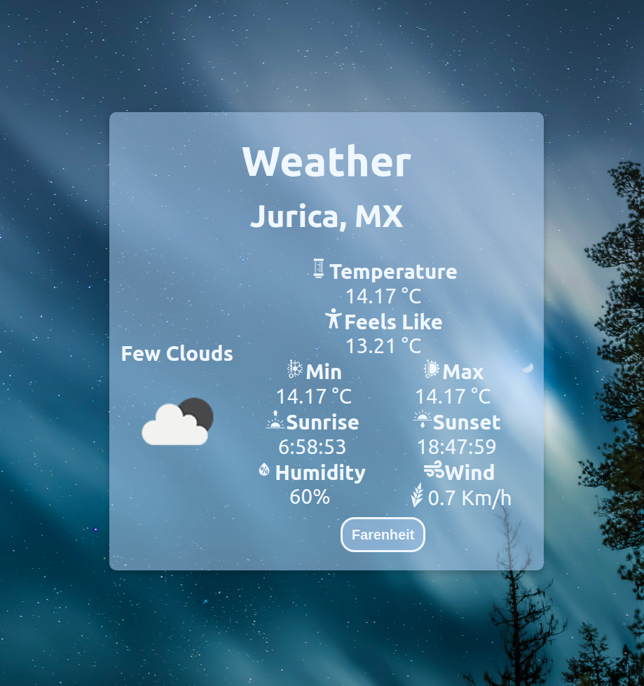

# Weather App

Weather in your location with background according to current weather.

## Description

This is my [Second Project](https://diego-angeles-weather-app.netlify.app/) for the React module of the Web Full-Stack Bootcamp at [Academlo](https://www.academlo.com/)

## Resources

### Made With

- [React.js](https://reactjs.org/)
- [Weather API](https://openweathermap.org/api)

### Dependencies

- [React Icons](https://react-icons.github.io/react-icons)

### Deployment

- [Netlify](https://www.netlify.com/)

## Author

[@Diego-Angeles-Ake](https://github.com/Diego-Angeles-Ake)

## Acknowledgments

- Andrés Mendoza
